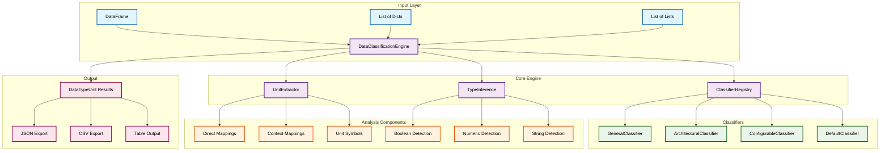
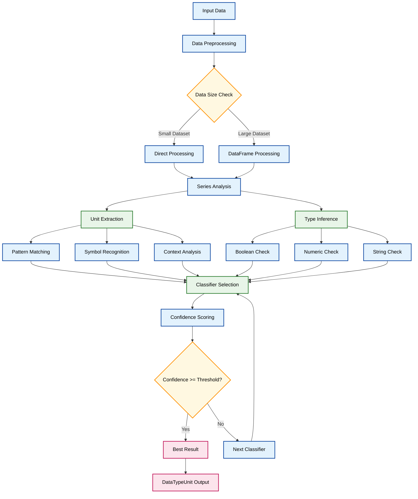
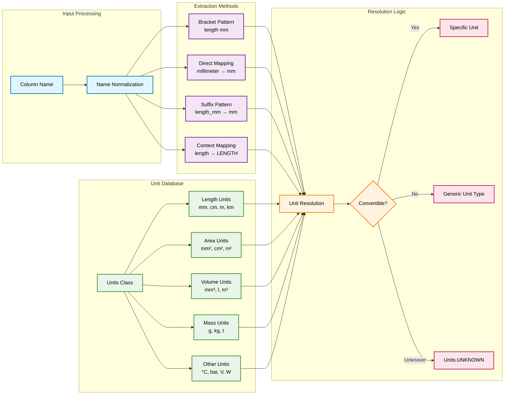

# DataFrame Analyzer

Ein hochperformanter Python-Analyzer für automatische Erkennung von Datentypen und Einheiten in strukturierten Daten. Optimiert für große Datensätze mit vektorisierten Operationen.

## 🚀 Features

- **Automatische Datentyp-Erkennung**: Intelligente Klassifizierung von String, Integer, Float und Boolean-Daten
- **Einheiten-Extraktion**: Erkennung und Klassifizierung von physikalischen Einheiten (Länge, Fläche, Volumen, Masse, etc.)
- **Vektorisierte Operationen**: Optimiert für große Datensätze mit pandas-basierten Operationen
- **Flexible Input-Formate**: Unterstützt pandas DataFrames, Listen von Dictionaries und Listen von Listen
- **Konfigurierbar**: YAML/JSON-basierte Konfiguration für Custom Patterns und Einheiten
- **Domain-spezifische Klassifikatoren**: Spezialisierte Klassifikatoren für Architektur/BIM-Daten
- **Export-Funktionen**: Exportiere Standard-Konfigurationen für weitere Anpassungen

## 📋 Abhängigkeiten

```python
dependencies = [
    "pandas>=2.0.0",
    "pyyaml>=6.0",
]
```

## 🏗️ Architektur

### Hauptarchitektur



### Klassifikations-Pipeline



### Unit-Extraction-System



## 🚀 Verwendung

### Als Standalone-Skript

#### Demo ausführen
```bash
python data_analyzer.py
```

#### CSV-Datei analysieren
```bash
python data_analyzer.py data.csv
```

#### Mit verschiedenen Output-Formaten
```bash
# Tabellen-Output (Standard)
python data_analyzer.py data.csv --format table

# JSON-Output
python data_analyzer.py data.csv --format json

# CSV-Output
python data_analyzer.py data.csv --format csv

# In Datei speichern
python data_analyzer.py data.xlsx --output results.json --format json
```

#### Excel-Datei mit Headern
```bash
python data_analyzer.py data.xlsx --contains-headers
```

#### Mit benutzerdefinierter Konfiguration
```bash
python data_analyzer.py data.csv --config my_config.yaml
```

#### Standard-Konfiguration exportieren
```bash
python data_analyzer.py --export-config default_config.yaml
```

### Als Python-Import

#### Grundlegende Verwendung

```python
import pandas as pd
from data_analyzer import analyze_data

# DataFrame analysieren
df = pd.DataFrame({
    'length_mm': [100, 200, 150],
    'weight_kg': [1.5, 2.0, 1.8],
    'is_active': ['yes', 'no', 'yes']
})

results = analyze_data(df)
for column, result in results.items():
    print(f"{column}: {result.data_type.value} ({result.unit.full_name}) - {result.confidence:.2f}")
```

#### Liste von Dictionaries
```python
from data_analyzer import analyze_data

data = [
    {'name': 'Item1', 'length_mm': '100', 'active': 'yes'},
    {'name': 'Item2', 'length_mm': '200', 'active': 'no'},
    {'name': 'Item3', 'length_mm': '150', 'active': 'yes'}
]

results = analyze_data(data)
```

#### Liste von Listen mit Headers
```python
from data_analyzer import analyze_data

data = [
    ['Item1', '100', 'yes'],
    ['Item2', '200', 'no'],
    ['Item3', '150', 'yes']
]

headers = ['name', 'length_mm', 'active']
results = analyze_data(data, headers=headers)
```

#### Mit Konfiguration
```python
from pathlib import Path
from data_analyzer import analyze_data

results = analyze_data(
    data=df, 
    config_path='my_config.yaml',
    merge_with_default=True
)
```

#### Engine direkt verwenden
```python
from data_analyzer import DataClassificationEngine, TypeInference, UnitExtractor

# Custom Engine erstellen
type_inference = TypeInference(numeric_threshold=0.8)
unit_extractor = UnitExtractor()
engine = DataClassificationEngine(type_inference, unit_extractor)

# Analysieren
results = engine.analyze(df)
```

## ⚙️ Konfiguration

### YAML-Konfigurationsdatei

```yaml
# Direct unit mappings (alternative Schreibweisen)
direct_mappings:
  "meter": "length (m)"
  "metre": "length (m)"
  "millimetre": "length (mm)"
  "kilogram": "mass (kg)"
  "degree": "angle (°)"

# Context mappings (Schlüsselwörter zu Unit-Typen)
context_mappings:
  "size": "length"
  "dimension": "length"
  "weight": "mass"
  "temperature": "temperature"
  "pressure": "pressure"

# Custom Classifiers
classifiers:
  construction:
    name: "Construction"
    priority: 3
    patterns:
      - pattern: ".*concrete.*"
        data_type: "string"
        unit: "none"
      - pattern: ".*reinforcement.*"
        data_type: "float"
        unit: "mass (kg)"
      - pattern: ".*load.*capacity.*"
        data_type: "float"
        unit: "mass (kg)"
  
  mechanical:
    name: "Mechanical"
    priority: 2
    patterns:
      - pattern: ".*torque.*"
        data_type: "float"
        unit: "power (W)"
      - pattern: ".*rpm.*"
        data_type: "integer"
        unit: "rotation (~)"
```

### JSON-Konfiguration

```json
{
  "direct_mappings": {
    "meter": "length (m)",
    "kilogram": "mass (kg)"
  },
  "context_mappings": {
    "size": "length",
    "weight": "mass"
  },
  "classifiers": {
    "custom": {
      "name": "Custom",
      "priority": 2,
      "patterns": [
        {
          "pattern": ".*height.*",
          "data_type": "float",
          "unit": "length (m)"
        }
      ]
    }
  }
}
```

### Konfiguration exportieren

```python
from data_analyzer import export_default_config

# Als YAML exportieren
export_default_config("my_config.yaml", "yaml")

# Als JSON exportieren  
export_default_config("my_config.json", "json")
```

## 🔧 Verfügbare Einheiten

### Längen-Einheiten
- Millimeter (mm), Zentimeter (cm), Meter (m), Kilometer (km)

### Flächen-Einheiten
- mm², cm², m²

### Volumen-Einheiten
- mm³, cm³, m³, Liter (l)

### Masse-Einheiten
- Gramm (g), Kilogramm (kg), Tonne (t)

### Technische Einheiten
- **Temperatur**: °C, K
- **Druck**: Pa, kPa, MPa, bar, psi  
- **Elektrisch**: V, kV, A, mA, W, kW, kWh
- **Geschwindigkeit**: m/s, km/h, mph
- **Winkel**: °, rad
- **Durchfluss**: l/s, l/min, m³/h

### Zeit-Einheiten
- Sekunde (s), Minute (min), Stunde (h)

### Mengen-Einheiten
- Stück (Stk), Pieces (pcs)

## 🎯 Domain-spezifische Klassifikatoren

### General Classifier
Erkennt allgemeine Datentypen:
- Boolean-Werte (`true/false`, `yes/no`, `ja/nein`)
- Längen, Breiten, Höhen, Tiefen
- Flächen und Volumen
- Gewicht und Masse
- Mengen und Anzahlen

### Architectural Classifier
Speziell für Architektur- und BIM-Daten:
- Phasen-Informationen
- Materialien
- Strukturelle Eigenschaften (`structural`, `load-bearing`)
- Feuerschutz-Eigenschaften (`fire-rated`)
- Höhenangaben und Elevationen

### Configurable Classifier
Vollständig konfigurierbar über YAML/JSON-Dateien für:
- Custom Patterns
- Domain-spezifische Terminologie  
- Projekt-spezifische Einheiten-Mappings

## 📊 Output-Format

### DataTypeUnit-Objekt

```python
class DataTypeUnit:
    data_type: DataType          # STRING, INTEGER, FLOAT, BOOLEAN
    unit: Unit                   # Einheiten-Objekt mit Symbol und Typ
    confidence: float            # Konfidenz-Score (0.0 - 1.0)
    classifier_name: str         # Name des verwendeten Klassifikators
    total_values: int           # Anzahl gültiger Werte
    null_count: int             # Anzahl None/NaN-Werte
    non_convertible_count: int  # Anzahl nicht-konvertierbarer Werte
    
    # Berechnete Properties
    convertible_percentage: float    # % konvertierbare Werte
    null_percentage: float           # % None/NaN-Werte  
    data_quality_score: float       # Gesamt-Qualitätsscore (0-1)
```

### Export-Formate

#### JSON-Format
```json
{
  "length_mm": {
    "data_type": "float",
    "unit": "length (mm)",
    "confidence": 0.85,
    "classifier": "Architectural"
  }
}
```

#### CSV-Format
```csv
column,data_type,unit,confidence,classifier
length_mm,float,"length (mm)",0.85,Architectural
weight_kg,float,"mass (kg)",0.90,General
is_active,boolean,"none",0.95,General
```

## 🚦 Performance-Optimierungen

- **Vektorisierte Operationen**: Nutzt pandas für effiziente Batch-Verarbeitung
- **Intelligente Data-Strategie**: Automatische Wahl zwischen direkter Verarbeitung und DataFrame-Konvertierung
- **Caching**: Interne Caches für Unit-Extraktion und Type-Inference
- **Confidence-basierte Optimierung**: Early-Exit bei hohen Konfidenz-Scores

### Performance-Schwellwerte
- **Small Data**: < 100 Zeilen → Direkte Verarbeitung
- **Large Data**: > 10.000 Zeilen → Immer DataFrame-Verarbeitung  
- **Medium Data**: 100-10.000 Zeilen → Adaptive Strategie

## 🔍 Troubleshooting

### Häufige Probleme

#### Problem: Falsche Datentyp-Erkennung
**Lösung**: Konfidenz-Schwellwert anpassen oder Custom Classifier erstellen

#### Problem: Einheiten werden nicht erkannt
**Lösung**: Custom Mappings in Konfigurationsdatei hinzufügen

#### Problem: Performance-Probleme bei großen Datasets
**Lösung**: `large_data_threshold` in DataClassificationEngine anpassen

### Debug-Informationen

```python
# Verfügbare Klassifikatoren anzeigen
engine = DataClassificationEngine()
print(engine.get_classifiers())

# Cache leeren
engine.clear_cache()

# Detaillierte Ergebnisse
result = engine.analyze(df)
for col, res in result.items():
    print(f"{col}: Quality={res.data_quality_score:.2f}, "
          f"Convertible={res.convertible_percentage:.1f}%")
```

## 📝 Beispiele

### Architektur-Daten
```python
architectural_data = pd.DataFrame({
    'wall_thickness_mm': [100, 150, 200],
    'elevation_m': [2.8, 3.0, 2.7], 
    'material': ['Concrete', 'Steel', 'Wood'],
    'fire_rated': ['yes', 'no', 'yes'],
    'structural': [True, True, False]
})

results = analyze_data(architectural_data)
# Erkennt automatisch Längeneinheiten, Materialien und Boolean-Eigenschaften
```

### Technische Messdaten
```python
sensor_data = pd.DataFrame({
    'temperature_celsius': [20.5, 22.1, 19.8],
    'pressure_bar': [1.2, 1.5, 1.1],
    'voltage_v': [230, 235, 228],
    'active': ['on', 'off', 'on']
})

results = analyze_data(sensor_data)
# Erkennt Temperatur, Druck, Spannung und Boolean-Status
```

## 🤝 Erweiterung

### Custom Classifier erstellen

```python
from data_analyzer import BaseClassifier, PatternMatch, DataType, UnitType

class CustomClassifier(BaseClassifier):
    def __init__(self, priority, type_inference, unit_extractor):
        super().__init__("Custom", priority, type_inference, unit_extractor)
    
    def setup_patterns(self):
        self.patterns = [
            PatternMatch(
                pattern=r".*custom_pattern.*",
                data_type=DataType.FLOAT,
                unit_type=UnitType.LENGTH
            )
        ]

# In Engine registrieren
engine.registry.register(CustomClassifier(5, engine.type_inference, engine.unit_extractor))
```

## 📄 Lizenz

Dieses Projekt ist unter der MIT-Lizenz lizenziert.